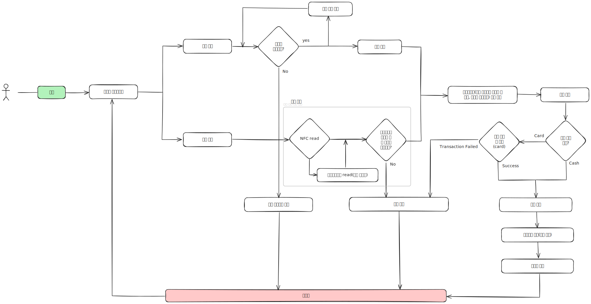

# 🥤 자판기 시뮬레이터



## 📋 프로젝트 개요

이 프로젝트는 Next.js와 TypeScript를 사용하여 구현된 인터랙티브 자판기 시뮬레이터입니다.
사용자는 현금 또는 카드로 결제하면서 음료를 구매할 수 있으며, 실제 자판기의 동작을 시뮬레이션합니다.

## ✨ 주요 기능

### 🥤 음료 선택

- **콜라** (1,100원)
- **물** (600원)
- **커피** (700원)

### 💰 결제 시스템

- **현금 결제**: 100원, 500원, 1,000원, 5,000원, 10,000원 단위
- **카드 결제**: 올바른 카드로 결제 가능
- **거스름돈 자동 계산 및 반환**

## 🛠 기술 스택

- **Framework**: Next.js
- **Language**: TypeScript
- **Styling**: Tailwind CSS
- **State Management**: Jotai
- **Package Manager**: Bun
- **Testing**: Jest, React Testing Library

## 📦 설치 및 실행

### 1. 의존성 설치

```bash
bun install

# OR
npm install
yarn install
```

### 2. 개발 서버 실행

```bash
bun dev

# OR
npm run dev
yarn run dev
```

### 3. 프로덕션 빌드

```bash
bun build
bun start
```

## 🧪 테스트

### 테스트 환경 설정

이 프로젝트는 Jest와 React Testing Library를 사용하여 테스트 환경이 구성되어 있습니다.

#### 설치된 테스트 관련 패키지

```json
{
  "@testing-library/react": "^14.3.1",
  "@testing-library/jest-dom": "^6.6.3",
  "@types/jest": "^29.5.14",
  "jest": "^29.7.0",
  "jest-environment-jsdom": "^29.7.0",
  "ts-jest": "^29.4.0"
}
```

#### Jest 설정 파일

- `jest.config.js`: Jest 기본 설정
- `jest.setup.js`: 테스트 환경 설정 (jsdom, Next.js router mock 등)

### 테스트 실행

```bash
# 모든 테스트 실행
npx jest

# 테스트 감시 모드
npx jest --watch

# 커버리지 리포트와 함께 실행
npx jest --coverage
```

### 테스트 구조

```
__tests__/
├── vending-util.test.ts                    # 거스름돈 계산 유틸리티 테스트
└── use-vending-machine-state.test.tsx      # 자판기 상태 관리 훅 테스트
```

### 테스트 커버리지

#### 1. vending-util.test.ts

거스름돈 계산 함수(`calculateChange`)에 대한 테스트:

- ✅ 거스름돈이 필요 없는 경우 (빈 배열 반환)
- ✅ 간단한 거스름돈 계산 (1000원 - 600원 = 400원)
- ✅ 복잡한 거스름돈 계산 (10000원 - 1100원 = 8900원)
- ✅ 큰 금액의 거스름돈 계산 (50000원 - 12300원 = 37700원)
- ✅ 정확한 동전 단위 거스름돈 (5000원 - 1000원 = 4000원)
- ✅ 최소 단위보다 작은 거스름돈 (1000원 - 999원 = 1원 → 거슬러줄 수 없음)
- ✅ 지불 금액이 부족한 경우 (500원 - 1000원 → 빈 배열)
- ✅ 모든 현금 단위를 내림차순으로 사용하는지 확인
- ✅ 가격이 0원인 경우
- ✅ 총 지불 금액이 0원인 경우

#### 2. use-vending-machine-state.test.tsx

자판기 상태 관리 훅에 대한 테스트:

**기본 기능 테스트:**

- ✅ 기본값 초기화 테스트
- ✅ 음료 선택 후 타이머 종료 시 음료 배출 및 상태 초기화

**현금 결제 테스트:**

- ✅ 현금 결제 시 거스름돈 자동 계산 및 배출
- ✅ 현금 투입 시 개수 관리
- ✅ 현금 투입 시 총액 계산
- ✅ 여러 단위 현금 투입 처리
- ✅ 현금 반환 기능
- ✅ 모든 상태 초기화 기능
- ✅ 음료 배출 목록 초기화 기능

**카드 결제 테스트:**

- ✅ 카드 결제 시 거스름돈 배출 안함
- ✅ 카드 결제 시 투입된 현금 반환
- ✅ 카드 결제 방식 선택
- ✅ 카드→현금 결제 방식 전환
- ✅ 카드 결제 상태에서 모든 상태 초기화
- ✅ 카드 결제 후 음료 배출 목록 초기화

**결제 방식 전환 테스트:**

- ✅ 현금→카드 전환 시 투입된 현금 초기화
- ✅ 같은 결제 방식 중복 선택 방지

### 테스트 실행 결과 예시

```bash
$ npx jest

 PASS  __tests__/vending-util.test.ts
 PASS  __tests__/use-vending-machine-state.test.tsx

Test Suites: 2 passed, 2 total
Tests:       17 passed, 17 total
Snapshots:   0 total
Time:        1.2 s
```

### 테스트 작성 가이드라인

1. **테스트 파일 위치**: 모든 테스트는 `__tests__/` 폴더에 위치
2. **테스트 명명**: 한글로 기능을 명확히 설명하는 테스트명 사용
3. **테스트 구조**: `describe` → `it` → `expect` 구조로 작성
4. **상태 관리**: Jotai 상태 변경 시 `act(() => {})`로 상태 반영 대기
5. **비동기 처리**: `setTimeout` 등은 `jest.useFakeTimers()`와 `jest.runAllTimers()` 사용

## 🏗 프로젝트 구조

```
fe-assignment-protopie/
├── app/
│   ├── layout.tsx
│   └── page.tsx                 # 메인 페이지
├── components/                   # 공통 컴포넌트
│   └── dialog.tsx              # 다이얼로그 컴포넌트
├── features/                     # 기능별 모듈
│   └── vending-machine/         # 자판기 기능
│       ├── components/          # 자판기 관련 컴포넌트
│       ├── hooks/              # 커스텀 훅
│       ├── lib/                # 유틸리티 및 설정
│       ├── pages/              # 페이지 컴포넌트
│       └── types.ts            # 타입 정의
├── lib/                         # 공통 라이브러리
├── public/                      # 정적 파일
│   ├── beverage/               # 음료 이미지
│   └── diagram-vending-machine.svg
├── styles/                      # 스타일 파일
├── __tests__/                   # 테스트 파일
│   ├── vending-util.test.ts
│   └── use-vending-machine-state.test.tsx
├── jest.config.js               # Jest 설정
└── jest.setup.js                # Jest 환경 설정
```

## 🎮 사용 방법

### 현금 결제

1. **현금 투입**: 현금 투입 버튼을 클릭하여 지폐/동전 투입
2. **음료 선택**: 원하는 음료 버튼 클릭
3. **결제 확인**: 투입된 금액이 음료 가격보다 많으면 자동으로 거스름돈 반환

### 카드 결제

1. **카드 태깅**: NFC 카드 또는 마그네틱 카드 사용
2. **음료 선택**: 원하는 음료 버튼 클릭
3. **결제 완료**: 카드 정보 검증 후 결제 처리

## 🔧 주요 컴포넌트

### 상태 관리

- `use-vending-machine-state.ts`: 자판기 상태 관리 훅
- `vending-machine.ts`: 자판기 상태 로직

### UI 컴포넌트

- `beverage-select-button.tsx`: 음료 선택 버튼
- `cash-payment-button.tsx`: 현금 결제 버튼
- `card-payment-button.tsx`: 카드 결제 버튼
- `money-container.tsx`: 투입된 금액 표시
- `exchange-dispatch-button.tsx`: 거스름돈 반환 버튼

## 📱 브라우저 지원

- Chrome (최신 버전)
- Firefox (최신 버전)
- Safari (최신 버전)
- Edge (최신 버전)
